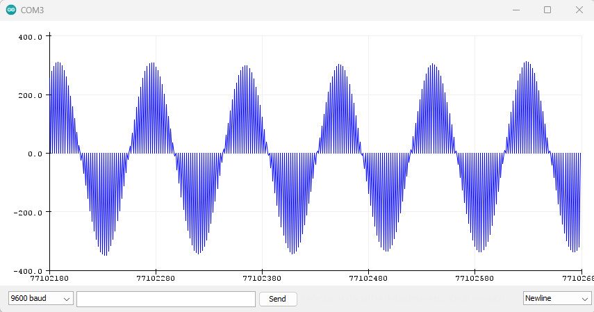
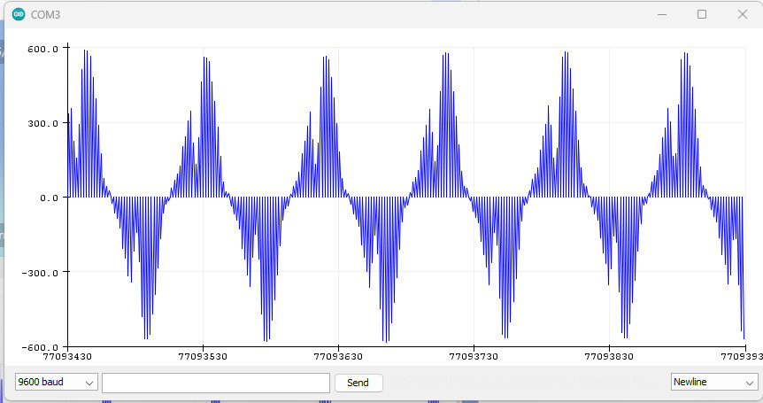
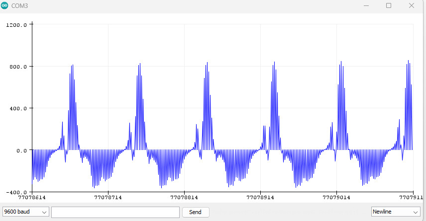
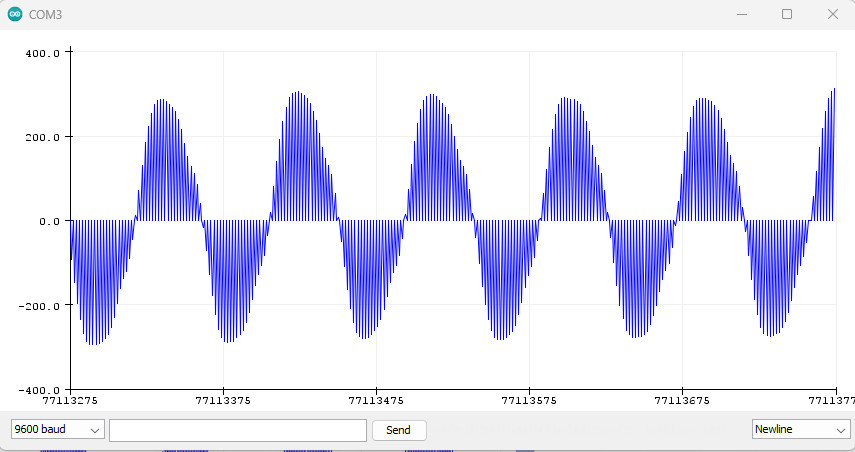

# Báo cáo công việc ngày 14/7/2023

## A.Công việc đã làm

- Đọc dữ liệu bằng DMA, hiển thị dạng sóng 
- Tìm hiểu FFT, cài đặt arm-math theo đồ án anh Thao


## B.Quá trình thực hiện

### 1. Đọc dữ liệu bằng DMA
- Code chi tiết:[]()
- Code khởi động DMA:
```
void DMA_Start()
{
    DMA1_Stream3 -> CR  |= 1 << 0;


}
```

- Code kết thúc DMA:
```
void DMA_Stop()
{
    DMA1_Stream3 -> CR &= ~(1 << 0);

}
```

- Chuyển dữ liệu từ ngoại vi sang bộ nhớ:
```
void DMA_ReadSampleStart()
{
    DMA_ClearFlag(DMA1_Stream3, DMA_FLAG_TCIF3);
    DMA_ClearFlag(DMA1_Stream3, DMA_FLAG_HTIF3);
}
void DMA_WaitReadSample()
{
    /*Wait until for data transfer complete*/
    while(!(DMA1 ->LISR & DMA_LISR_TCIF3));
    /*Clear flag Transfer complete*/
    DMA1 -> LIFCR |= DMA_LIFCR_CTCIF3;

}

void ReadI2SIntoBuffer()
{
    /*Start DMA*/
    DMA_ReadSampleStart();
    /*Wait recieve complete*/
    DMA_WaitReadSample();
}
```

- Code đọc và hiển thị dạng sóng lên màn hình:
```
		DMA_Start();
       ReadI2SIntoBuffer();
       DMA_Stop();
       for(int i=0;i<BuffLength;i++)
        {
           Serial_Printf(USART2,"%d",DMABuffer[i]);
          Serial_Printf(USART2,"\n");
        }
```
- Tần số lấy từ trang [onlinetonegenerator](https://onlinetonegenerator.com/)
- Hình dạng sóng sine:

- Hình dạng sóng vuông:

- Hình dạng sóng răng cưa:

- Hình dạng sóng tam giác:

### 2. Tìm hiểu về FFT, cài đặt arm-math
- FFT (Fast Fourier Transform) là một thuật toán tính toán phổ tần số của các tín hiệu, giúp chuyển đổi một tín hiệu trong miền thời gian sang miền tần số.
- Cài đặt cho project arm-math của anh Thao, có một số hàm quan trọng trong fft:
  * arm_cfft_radix4_f32(): Hàm này thực hiện FFT trên dữ liệu đầu vào sử dụng giải thuật Radix-4.

  * arm_cfft_radix2_f32(): Hàm này thực hiện FFT trên dữ liệu đầu vào sử dụng giải thuật Radix-2.

  * arm_rfft_fast_f32(): Hàm này thực hiện FFT nhanh trên dữ liệu đầu vào thực (real-time FFT), giúp tăng tốc quá trình tính toán FFT so với việc sử dụng FFT truyền thống.

## C. Khó khăn đang gặp

## D. Công việc tiếp theo
- Cài đặt, hiển thị dạng sóng khi dùng FFT
